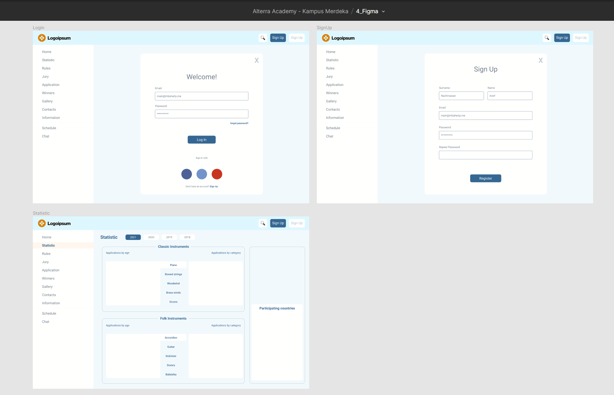

# 04 Figma

## Resume

Pada materi ini, saya mempelajari:

-   Apa itu figma
-   Tools dan Shortcut
-   Prototype

### Apa itu figma

Figma merupakan editor grafik berbasis vector dan alat prototyping yang berbasis web.

Beberapa kelebihan figma antara lain:

-   Free
-   Dapat berjalan di Windows dan MacOS
-   Real time collaboration bersama team
-   Import file sketch
-   Integrasi developer secara terpisah
-   Library yang beragam
-   Membuat prototype yang maksimal

Kekurangan figma hanya satu, yaitu kita harus terkoneksi dengan internet agar dapat bekerja secara maksimal. Tapi, kita bisa menggunakan figma secara offline, file akan di save di local disk kita.

### Tools dan Shortcut

Beberapa tools dengan shortcut yang bisa memudahkan kita menggunakan figma antara lain:

-   Frame tools (Shortcut: F) - Digunakan untuk membuat frame atau artboard.
-   Rectangle tools (Shortcut: R) - Digunakan untuk membuat shape rectangle.
-   Elipse tools (shortcut: O) - Digunakan untuk membuat shape lingkaran. Dengan menekan shift akan membuat lingkaran sempurna.
-   Move tools (Shortcut: V) - Digunakan untuk memindahkan elemen yang sedang kita pilih.
-   Text tools (Shortcut: T) - Digunakan untuk membuat typography.
-   Auto layout (Shortcut: Shift + A) - Akan membuat frame disekitar elemen yang kita pilih, dan akan mempermudah kita untuk mengedit elemen tersebut.
-   Move element to front / back (Shortcut: Shift + Ctrl + [ / ]) - Digunakan untuk memindahkan elemen yang sedang kita pilih ke depan atau ke belakang elemen lain.
-   Place image tools (Shortcut: Shift + Ctrl + K) - Digunakan pada elemen shape yang kita pilih, akan memasukkan gambar ke shape tersebut.

Tekan tombol (Alt) ketika memindahkan elemen akan menunjukkan jarak elemen ke elemen terdekat.  
Tekan tombol (Shift) ketika memindahkan elemen akan memindahkan elemen secara lurus.

#### Frame dan Grid

Untuk membuat frame dan grid, kita dapat menseleksi frame yang telah kita buat, kemudian di panel sebelah kanan kita bisa memilih menu Layout Grid, dengan menekan tombol tambah (+), panel setting grid akan muncul.

#### Reusable Color

Untuk menggunakan warna yang akan kita gunakan terus di project desain kita, kita bisa save color yang kita pilih dengan cara di panel kanan, klik tombol biru yang terdapat di menu Fill, kemudian klik tombol tambah (+).

#### Reusable Component

Untuk membuat komponen yang dapat dipakai berulang kali, kita bisa memilih elemen yang ingin kita jadikan reusable component, kemudian di panel kiri kita bisa klik tombol Create Component.
Untuk memakai reusable component, di panel kiri kita bisa klik tombol Assets, kemudian drag and drop komponen yang ingin kita pakai ke canvas.

### Prototype

Untuk membuat prototype, kita bisa lakukan cara berikut:

-   Di panel kanan, kita bisa masuk tab prototype.
-   Untuk membuat navigasi, kita bisa drag tombol lingkaran di sebelah elemen yang ingin kita jadikan navigasi, kemudian drop di elemen tujuan.
-   Ketika koneksi terhubung panel property akan muncul, di panel ini kita bisa mengatur animasi, atau jenis interaction.
-   Untuk melihat hasil prototype, kita bisa klik tombol Play di kanan atas.

---

## Task

### 1. Buatlah sebuah desain UI/UX dari desain yang dipilih

### 2. Buatlah prototype dari desain yang telah kalian buat

Link preview figma untuk tugas section ini bisa diakses di [sini](https://www.figma.com/file/GMhqliR7kpWVZul5RmEUi5/4_Figma).

