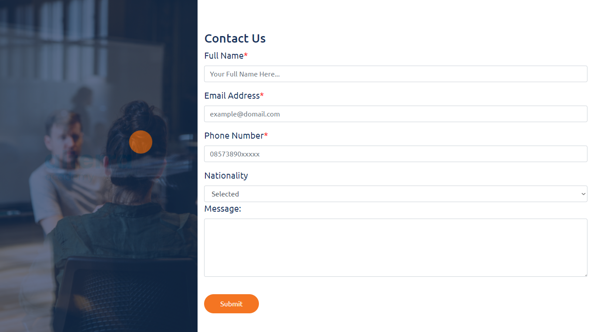

# 10 Introduction React

## Resume

Pada materi ini saya mempelajari:

-   Apa itu React
-   Virtual DOM
-   Cara membuat project menggunakan React

### Apa itu React

React JS Merupakan library javascript yang dapat digunakan untuk membuat user interface sebuah website.

Kenapa menggunakan React?

-   Declarative
-   Berbasis komponen
-   Learn once, write many
-   Sudah teruji
-   Popular

### Virtual DOM

Apa itu Virtual DOM? Virtual DOM adalah representasi dari UI yang berbentuk javascript object, dan disimpan pada memory.

Manipulasi DOM secara langsung menimbulkan beberapa masalah, yaitu:

-   Membuat code berantakan
-   Sulit mengingat state DOM sebelumnya
-   Jauh lebih lambat

### Membuat Project React

Untuk membuat project menggunakan React, pertama-tama pastikan kita sudah menginstall Node.js.  
Kemudian jalankan terminal di folder project kita, dan jalankan command:

```node
npx create-react-app [nama-project]
```

Node JS akan membuat folder project yang baru dengan nama yang kita tentukan, dengan React didalamnya.
Beberapa file didalam folder tersebut antara lain:

-   Package.json, yang berisi informasi tentang project yang kita buat.
-   Folder public, yang berisi file yang dapat diakses secara langsung, seperti favicon, robots, index.html, dan lain-lain.
-   Folder src, yang berisi file source code dari aplikasi kita.

---

## Task

### Membuat project react berdasarkan file resource yang sudah ada.

Untuk task kali ini, saya harus membuat project react berdasarkan file html, css, dan js yang diberikan.

#### Berikut hasil dari task ini:

Source code dapat diakses di [Github Repository](https://www.github.com/mbaharip/Assignment-Introduction-React)

  


