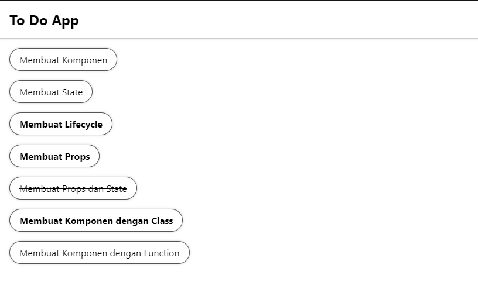

# 11 React Fundamental

## Resume

Pada materi ini saya mempelajari:

-   JSX dan Component
-   React Lifecycle
-   Directory Structure dan Styling

### JSX dan Component

#### JSX

JSX merupakan singkatan dari Javascript XML yang penggunaannya sangat disarankan di React.  
Kenapa menggunakan JSX?

-   Dibuat berdasarkan fakta jika logika rendering dan logic UI sangat terikat
-   Separation of Technology → Separation of Concern

Spesifikasi jenis elemen react:

-   Component react, huruf awal menggunakan kapital (contoh: App, Header, Footer, etc)
-   Component HTML, huruf awal menggunakan huruf kecil (contoh: div, p, span, etc)

Kita dapat menaruh expression js pada jsx dengan cara menggunakan kurung kurawal.

#### Component

React component adalah bagian code yang dapat digunakan kembali untuk menghasilkan sebuah UI.  
Tata cara membagi UI pada React:

-   Menggambar kotak untuk membagi komponen dan sub komponen dari mockup
-   Gunakan teknik KISS, dimana satu komponen hanya memiliki satu fungsi atau tujuan

Component Props atau properties, membuat kita dapat memberikan argumen data ke dalam komponen, properties ini yang akan membantu kita untuk membuat komponen lebih dinamis.  
Flow data props di komponen berjalan dari atas kebawah atau dari parent ke child, tidak sebaliknya.

### React Lifecycle

React lifecycle adalah sederetan event dari awal komponen muncul sampai komponen menghilang.

-   Mounting, dapat diartikan sebagai pada saat komponen tersebut terlahir
-   Updating, dapat diartikan sebagai pada saat komponen tersebut tumbuh
-   Unmounting, dapat diartikan sebagai pada saat komponen tersebut mati

Lifecycle method yang umum digunakan antara lain:

-   render(), method ini digunakan untuk menampilkan komponen yang telah dibuat
-   componentDidMount(), method ini dipanggil ketika komponent sudah di render untuk pertama kali, dan di method ini adalah tempat yang tepat untuk memanggil API
-   componentDidUpdate(), method ini dipanggil ketika terjadi props / state berubah
-   componentWillUnmount(), method ini dipanggil ketika komponen akan dihancurkan, sangat cocok untuk clean up action

### Directory Structure dan Styling

#### Directory Structure

React sebenarnya tidak memiliki pendapat tentang bagaimana cara kita mengatur file yang ada di dalam folder, tetapi ada beberapa cara yang bisa kita gunakan untuk membuat struktur folder lebih baik, antara lain:

-   Pengelompokkan berdasarkan fitur atau route
-   Pengelompokkan berdasarkan jenis file

Ada juga tips mengenai cara menentukan structure folder yang lebih baik, antara lain:

-   Hindari terlalu banyak nesting, sebaiknya tidak lebih dari 3 level
-   Jangan terlalu memikirkannya

#### Styling

Ada 3 cara untuk mengatur styling pada React:

-   Menggunakan CSS dan class  
    Sama seperti di HTML, kita dapat membuat class di file CSS, kemudian kita dapat mengimport file css tersebut dan menggunakannya pada element yang kita inginkan.  
    Kekurangannya adalah, style tersebut akan mengubah semua element dengan selector yang sama.
-   Attribute Style  
    Sama seperti inline CSS pada HTML, kita menulis langsung style yang kita inginkan pada attribute element.  
    Kelebihannya adalah style tersebut adalah lokal atau hanya berlaku pada element yang kita inginkan, tetapi akan membuat code kita terlalu panjang.
-   Module CSS
    Sama seperti pertama, tetapi module CSS hanya mempengaruhi satu komponen saja.  
    Untuk menggunakan module css, kita tinggal membuat css seperti biasa dengan penamaan [NamaCSS].module.css, kemudian import module tersebut sebagai variable, dan kita tinggal memanggilnya di attribute className element.  
    Contoh:

    ```jsx
    import style from './NamaCSS.module.css';

    return (
    	<div className={style.namaClass}>
    		<p>Ini adalah text yang akan diubah stylenya</p>
    	</div>
    );
    ```

---

## Task

Pada task kali ini, saya harus membuat aplikasi todo list menggunakan react. Poin terpenting pada task ini yaitu:

-   Komposisi komponen
-   Implementasi list rendering
-   Styling

Source code ada di [Github Repository](https://www.github.com/mbaharip/Assignment-React-Fundamental)  
Berikut hasil dari task ini:  

