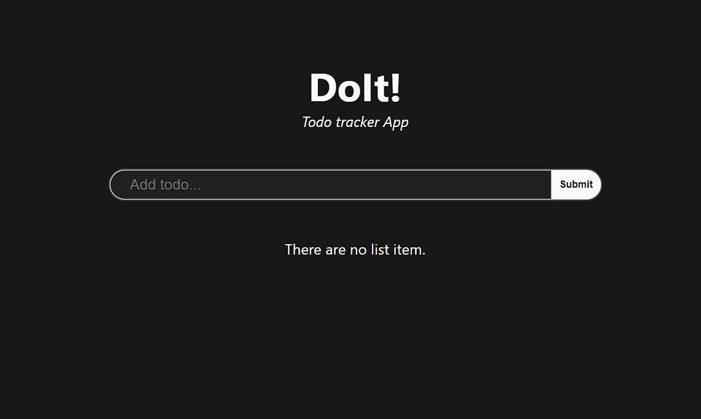

# 13 Event Handling

## Resume

Pada materi ini saya mempelajari:

-   State
-   Stateful and Stateless
-   Event Handling

### State

#### Apa itu State?

State adalah data private sebuah component. Data ini hanya tersedia untuk component tersebut dan tidak bisa diakses dari component lain.  
Beberapa point mengenai state:

-   Data dapat dimodifikasi menggunakan setState
-   Setiap terjadi modifikasi, akan terjadi render ulang
-   Bersifat asynchronous
-   Dipakai dalam class

#### Perbedaan State dan Props

| State                                  | Props                           |
| -------------------------------------- | ------------------------------- |
| State dapat di modifikasi              | Props tidak dapat di modifikasi |
| Pergantian state bersifat asynchronous | Props hanya bisa read-only      |

### Stateful and Stateless

#### Apa itu Stateful component?

Stateful component adalah component yang memiliki state.

#### Apa itu Stateless component?

Stateless component adalah component yang tidak memiliki state, tetapi hanya memiliki prop.

#### Perbedaan antara Stateful dan Stateless component

| Stateless Component                          | Stateful Component                     |
| -------------------------------------------- | -------------------------------------- |
| Tidak tahu tentang aplikasi                  | Mengerti tentang aplikasi              |
| Tidak melakukan data fetching                | Melakukan data fetching                |
| Tujuan utamanya adalah visualisasi           | Berinteraksi dengan aplikasi           |
| Dapat digunakan kembali                      | Tidak dapat digunakan kembali          |
| Hanya berkomunikasi dengan induknya langsung | Meneruskan status dan data ke children |

### Event Handling

#### Apa itu event handling?

Event Handling adalah suatu metode untuk menangai sebuah event / action yang diberikan user kepada component.  
Event adalah suatu peristiwa yang dipicu oleh user pada suatu component, misal tombol diklik.

#### Beberapa contoh list event

Berikut beberapa contoh event yang bisa diterima oleh component:

-   onChange, Event yang terjadi ketika user mengubah data
-   onSubmit, Event yang terjadi ketika user mengirim data
-   onClick, Event yang terjadi ketika user mengklik
-   onDoubleClick, Event yang terjadi ketika user mengklik dua kali
-   onMouseOver, Event yang terjadi ketika mouse berada di area component
-   onError, Event yang terjadi ketika terjadi error
-   onLoad, Event yang terjadi ketika data sudah selesai dimuat

---

## Task

Pada task ini saya harus membuat todo list dengan menggunakan state dan event handling.  
Terdapat beberapa ketentuan pada task ini, antara lain:

-   Daftar todo dapat ditambahkan menggunakan input
-   Terdapat checklist pada setiap todo
-   Aktifkan checklist jika todo selesai
-   Terdapat tombol hapus untuk menghapus todo
-   Jika input kosong, tampilkan alert

Source code dapat dilihat di [Github repository](https://www.github.com/mbaharip/Assignment-Todo-List)  
Berikut adalah hasilnya:

