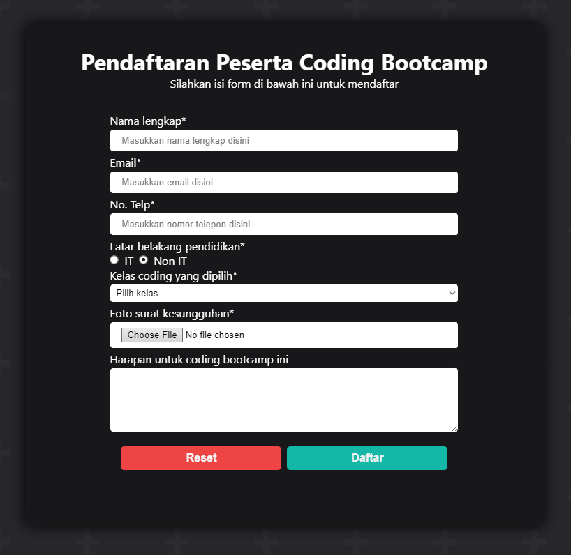
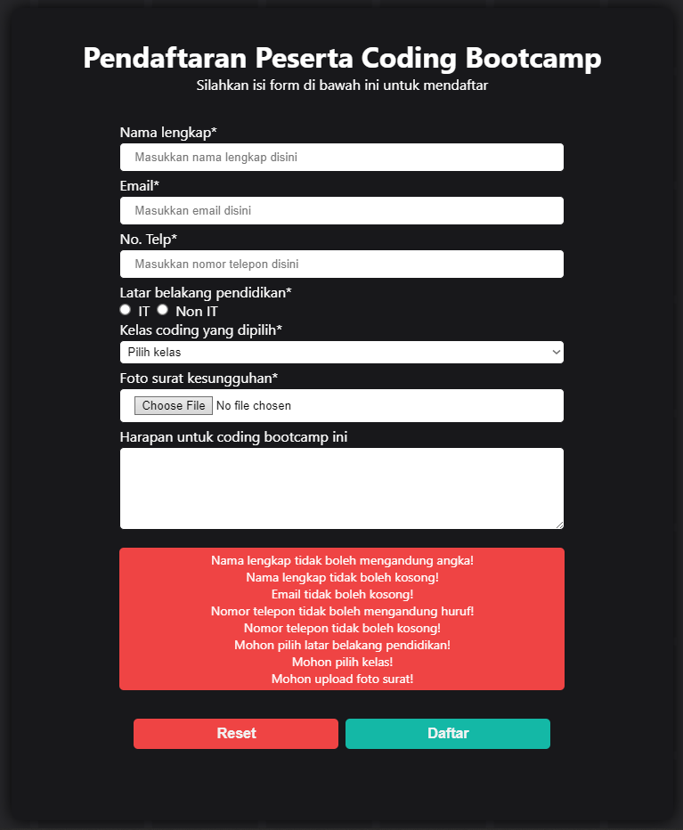
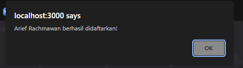
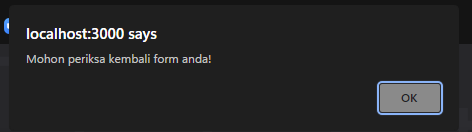

# 15 React Forms

## Resume

Pada materi ini saya mempelajari:

-   Basic Form
-   Controlled dan Uncontrolled Components
-   Basic Validation

### Basic Form

#### Penjelasan form

Form merupakan salah satu hal krusial dalam pengembangan aplikasi web.  
Form banyak kita jumpai saat login, mendaftarkan sesuatu, memberi feedback, dan lain-lain.

#### Element pada form

Ada beberapa element pada form, yaitu:

-   Input, digunakan untuk inputan yang tidak terlalu panjang
-   Textarea, digunakan untuk inputan yang cukup panjang
-   Select, digunakan untuk inputan yang pilihannya sudah ditentukan
-   Radio Button, sama seperti select, tetapi berbentuk lingkaran yang bisa di tekan.
-   Checkbox, sama seperti radio button, tetapi kita bisa memilih lebih dari 1 pilihan.

### Controlled dan Uncontrolled Components

#### Apa itu Controlled Components?

Controlled Components adalah sebuah component yang memiliki state dan dapat diubah oleh user.  
Contoh:

```jsx
import { useState } from 'react';

export default function EssayForm() {
	const [essay, setEssay] = useState('');

	return (
		<form>
			<label htmlFor='essay'>Essay:</label>
			<textarea id='essay' name='essay' value={essay} onChange={(e) => setEssay(e.target.value)} />
		</form>
	);
}
```

#### Apa itu Uncontrolled Components?

Uncontrolled Components adalah sebuah component yang tidak memiliki state dan perubahannya tidak secara real time.  
Contoh:

```jsx
import { useRef } from 'react';

export default function EssayForm() {
	const inputEssay = useRef(null);

	const handleSubmit = (e) => {
		e.preventDefault();
		alert(inputEssay.current.value);
	};

	return (
		<form onSubmit={handleSubmit}>
			<label htmlFor='essay'>Essay:</label>
			<textarea id='essay' name='essay' value={essay} ref={inputEssay} />
		</form>
	);
}
```

Dikarenakan tidak memakai state, maka tidak ada default value.  
Untuk menambahkan default value, kita bisa menambahkan attribute defaultValue pada element input.

#### Perbedaan

| Fitur                                 | Uncontrolled | Controlled |
| ------------------------------------- | ------------ | ---------- |
| One-time value retrieval              | Yes          | Yes        |
| Validating on submit                  | Yes          | Yes        |
| Instant filed validation              | No           | Yes        |
| Conditionally disabling submit button | No           | Yes        |
| Enforcing input format                | No           | Yes        |
| Several inputs for one piece of data  | No           | Yes        |
| Dynamic Inputs                        | No           | Yes        |

### Basic Validation
#### Fungsi validasi
Ada beberapa alasan validasi form diperlukan:
- Mencari input data yang benar dan sesuai format
- Menghindari kesalahan penggunaan input

#### Client-side Validation
Validasi ini dilakukan pada sisi client atau di browser. Validasi ini dilakukan agar data input ke server sesuai dengan format yang ditentukan.  
Untuk membuat validasi ini, terdapat 2 cara, yaitu:
- Built-in form validation, yaitu dengan menggunakan attribute required, min, max, pattern, dan yang lainnya.
- Menggunakan javascript, yaitu dengan menggunakan regular expression.

#### Server-side Validation
Validasi ini dilakukan pada sisi server. Sisi server bertugas untuk memvalidasi data kembali sebelum disimpan ke database.  
Jika ditemukan kesalahan, maka response akan dikirim kembali ke client berupa koreksi atas kesalahan yang dibuat oleh pengguna.

---

## Task

Untuk task kali ini saya diharuskan membuat form dengan ketentuan berikut:

-   Field nama wajib, dan hanya menerima huruf.
-   Field email wajib
-   Field telepon wajib, dan hanya menerima angka dengan panjang antara 9 - 14
-   Radio group latar pendidikan wajib
-   Field pilihan kelas wajib
-   Field foto surat wajib
-   Field harapan optional
-   Tombol submit bersifat wajib akan mensubmit form, dan mereset form
-   Tombol reset optional untuk mereset form dan pesan error
-   Error ditampilkan diantara field dan button

Berikut hasil task saya:
Source code dapat dilihat di [Github Repository](https://www.github.com/mbaharip/Assignment-React-Form)

### Form



### Form jika ada error



### Alert berhasil



### Alert error



```

```
