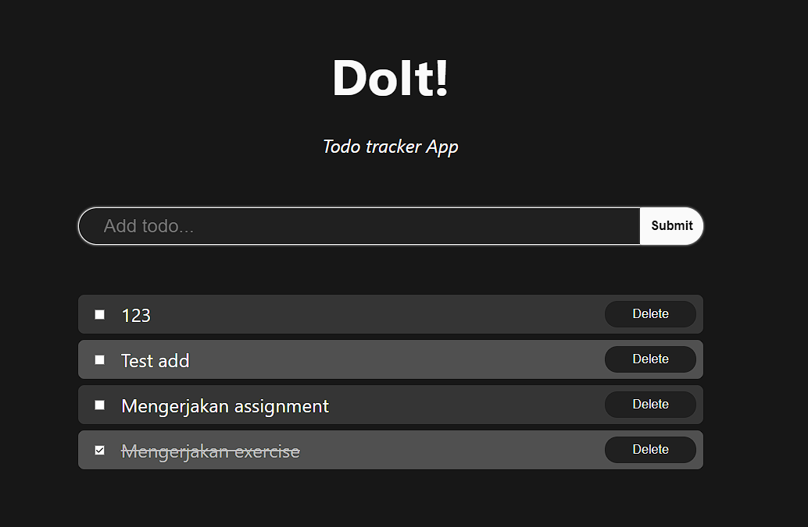
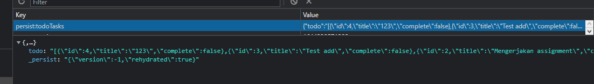

# 16 React Redux

## Resume

Pada materi ini saya mempelajari:

-   Global State
-   Redux Thunk dan Persistent State
-   Data Fetching

### Global State

Redux merupakan sebuah library untuk menyimpan state global. State global dapat diakses oleh semua komponen yang terhubung dengan Redux.  
Saat yang tepat untuk menggunakan Redux:

-   Banyak state yang perlu ditaruh di banyak tempat
-   State pada app sering berubah
-   Logic untuk mengubah state kompleks
-   Ukuran codebase yang sedang - besar, dan dikerjakan oleh banyak orang
-   Perlu untuk mengetahui bagaimana state diupdate seiring dengan waktu

Ada beberapa Redux library yang dapat digunakan, yaitu:

-   React-Redux
-   Redux Toolkit
-   Redux DevTools

Berikut merupakan komponen penting pada Redux:

-   Actions, yaitu sebuah object yang berisi data yang akan diubah state
-   Reducer, yaitu sebuah function yang mengubah state
-   Store, yaitu sebuah object yang menyimpan state dan reducer

Memakai dan mengubah state pada Redux dapat dilakukan dengan menggunakan:

-   Hooks
-   Connect

### Redux Thunk dan Persistent State

#### Redux Thunk

Redux Thunk merupakan middleware untuk redux yang memungkinkan kita untuk membuat action creator yang mengembalikan function.  
Alasan kita memperlukan Redux Thunk adalah untuk menghandle side effect logic seperti logic synchronous kompleks yang perlu mengakses store dan juga logic asynchronous seperti request data.

#### Persistent State

Setiap kita load aplikasi baru, aplikasi kita akan re-initialize state ulang. Ada saatnya kita membutuhkan persistent state dimana kita tidak perlu re-initialize state ketika aplikasi di load ulang.

Persistent State ini dapat dilakukan dengan menggunakan npm package redux-persist yang akan menyimpan state pada local storage.

### Data fetching

Data fetching adalah sebuah cara untuk mengambil data dari server.

Beberapa cara untuk fetching data di react antara lain:

-   Fetch API
-   Axios
-   React Query Library

#### Contoh Fetch API

```jsx
fetch('https://example.api.com', { options })
	.then((response) => {
		// Response dari API
	})
	.catch((error) => {
		// Error yang terjadi
	});
```

Berikut beberapa options yang dapat digunakan:

-   method - `GET`, `POST`, `PUT`, `DELETE`
-   url - URL dari request
-   body - Body dari request
-   headers - Object `Headers`
-   referrer - Referrer dari request
-   mode - `cors`, `no-cors`, `same-origin`
-   credentials - `omit`, `same-origin`
-   redirect - `follow`, `error`, `manual`
-   integrity - subresource integrity value
-   cache - `default`, `reload`, `no-cache`

---

## Task

Untuk task section ini, saya harus menambahkan redux dan redux-persist pada todo-app yang telah saya buat di section sebelumnya.

Berikut hasil task saya:  
Source code dapat dilihat di [Github Repository](https://www.github.com/mbaharip/Assignment-Todo-List-4)

### App



### Persistent State


