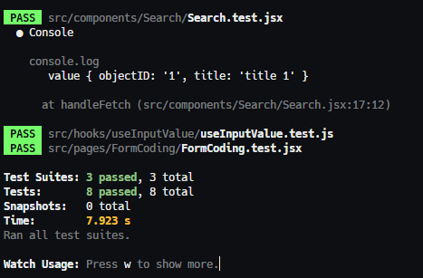

# 17 Testing

## Resume

Pada materi ini saya mempelajari :

-   Basic Testing
-   Create Basic Testing
-   Testing Custom Hook

### Basic Testing

#### Apa itu testing?

Testing adalah proses pengecekan suatu kode yang dibuat untuk mengecek apakah kode tersebut memiliki error atau tidak.  
Test assertion ini adalah ekspresi boolean yang mengembalikan nilai true, kecuali jika ada bug di kode kita.

#### Manfaat Testing

Testing memiliki manfaat sebagai berikut:

-   Ketika aplikasi kita mempunyai coverage yang baik, kita akan merasa percaya diri jika harus mengubah suatu bagian pada aplikasi kita.  
    Saat kita mengubah bagian tersebut, dan ada bagian yang lain yang error maka kita akan segera mengetahuinya.
-   Mengurangi bug pada aplikasi.  
    Walaupun testing tidak menjamin aplikasi bebas dari semua bug, tetapi kita bisa mencegah beberapa hal yang berpotensi menjadi bug.

#### Kategori Testing

Testing di React terbagi menjadi 2 kategori, yaitu:

-   Rendering Component Trees  
    Di dalam environment test yang sudah disederhanakan dan ditegaskan pada keluarannya.
-   Menjalankan aplikasi lengkap  
    Di dalam environment browser asli. Dikenal sebagai test "end-to-end".

### Create Basic Testing

#### Rendering component

Function render dari React Test Library akan merender file JSX yang dibutuhkan.
Setelah itu kita baru bisa memiliki akses ke komponen React yang akan kita test.  
Untuk meyakinkan bahwa file JSX sudah terender, kita bisa menggunakan function debug dari React Test Library.  
Selalu gunakan function debug dari React Test Library apabila tidak yakin seperti apa hasil dari fungsi render.

#### Memilih elemen untuk testing

React Testing Library memiliki beberapa function yang bisa digunakan untuk memilih elemen yang akan di test. Function ini bisa digunakan untuk memilih elemen yang akan di test.  
Beberapa contoh function yang bisa digunakan untuk memilih elemen yang akan di test:

-   getByText, memilih teks dari elemen yang akan di test
-   getByLabelText, memilih label dari elemen yang akan di test
-   getByPlaceholderText, memilih placeholder dari elemen yang akan di test
-   getByAltText, memilih alt dari elemen yang akan di test
-   getByDisplayValue, memilih display value dari elemen yang akan di test

#### Handle Event

Untuk handle event synchronous, kita bisa menggunakan function `jest.fn()` dan `fireEvent.[namaEvent]`  
Untuk handle event asynchronous seperti memanggil API, kita bisa menggunakan function `jest.mock('axios')` dan membuat skenario apabila berhasil dan tidak berhasil.

### Testing Custom Hook

#### Library yang digunakan

Testing Custom Hook adalah menggunakan library `react-hooks-testing-library`. Cara installnya adalah:`npm install -D @testing-library/react-hooks`

#### Implementasi

Untuk mengimplementasi testing Custom Hook, kita bisa menggunakan function `renderHook` yang ada di library `react-hooks-testing-library`.
Kemudian kita bisa menggunakan function `act` untuk menjalankan function yang akan di test.

---

## Task

Untuk task pada section ini, saya harus membuat file testing untuk code yang telah disediakan.

Berikut hasil task saya:  
Source code dapat dilihat di [Github Repository](https://www.github.com/mbaharip/Assignment-Testing)

