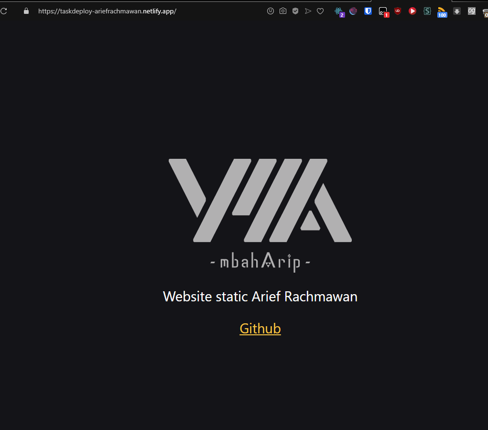

# 18 Deployment

## Resume

Pada materi ini saya mempelajari:

-   Build React App
-   Deployment
-   Deployment menggunakan Surge dan Netlify

### Build React App

#### Mengapa kita perlu build React App?

Alasan kita perlu untuk build project kita karena secara default, React memiliki banyak library yang hanya digunakan di development, tetapi tidak digunakan pada saat produksi.  
Oleh karena itu kita build untuk membuat versi produksi yang tidak memiliki library yang tidak diperlukan.  
Build project membuat aplikasi kita menjadi lebih ringan dan cepat.

#### Cara build React App

Kita bisa build React App dengan menggunakan command line:

```
npm run build
```

Command ini akan membuat versi produksi untuk aplikasi kita di dalam folder `build/`.  
Command ini hanya diperlukan sebelum men-deploy ke produksi, untuk pengembangan normal gunakan `npm start`.

#### Menjalankan optimized app

Setelah build, kita dapat menjalankan optimized versi produksi dengan menggunakan command line:

```js
// install serve secara global
npm install -g serve

// jalankan serve di lokal
serve -s build
```

### Deployment

#### Apa itu deployment?

Deployment adalah kegiatan yang bertujuan untuk mengirimkan aplikasi kita ke server. Dengan harapan aplikasi tersebut dapat diakses oleh banyak orang, bukan hanya kita sendiri.

### Deployment menggunakan Surge dan Netlify

#### Surge

Surge merupakan layanan static web deployment gratis untuk Front-End Developers. Website yang dideploy menggunakan surge akan memiliki subdomain `*.surge.sh`.  
Surge dapat menerima file HTML, CSS, dan JS.

#### Deployment dengan Surge

Pertama kita perlu meng-install surge dengan command line:

```js
npm install -g surge
```

Kemudian kita deploy ke surge dengan command line:

```js
surge;
```

#### Netlify

Netlify adalah salah satu platform penyedia layanan build tools sekaligus Continous Deployment. Netlify memungkinkan kita untuk mempublish website statis secara gratis.

#### Deployment dengan Netlify

Pertama-tama kita perlu membuat akun di [Netlify](https://www.netlify.com/).  
Kemudian kita perlu meng-install netlify-cli dengan command line:

```js
npm install -g netlify-cli
```

Untuk deploy ke netlify, kita bisa jalankan command line:

```js
netlify deploy
```

Command ini akan membuka browser untuk memverifikasi akses aplikasi.  
Apabila kita telah meng-verifikasi akses aplikasi, di CLI akan muncul beberapa pilihan, kita dapat memilih `Create & configure a new site`.  
Sesudah memilih menu tersebut, kita bisa memilih file yang akan di deploy, disini kita pilih folder build kita yaitu `./build`.  
Kemudian kita hanya perlu menunggu hingga deploy selesai.

---

### Task

Untuk task kali ini, saya diharuskan untuk deploy ke Surge / Netlify.

Berikut hasil task yang saya kerjakan:  
[taskDeploy-AriefRachmawan - Netlify](https://taskdeploy-ariefrachmawan.netlify.app)  

