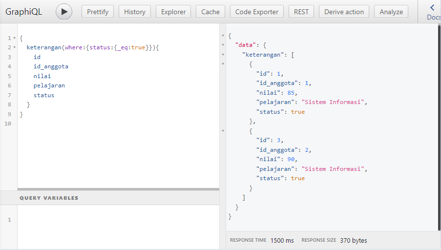
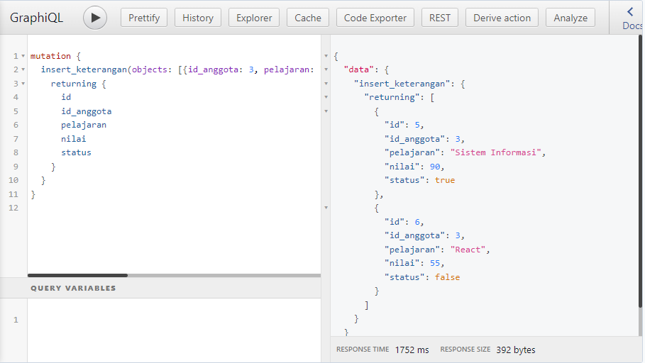
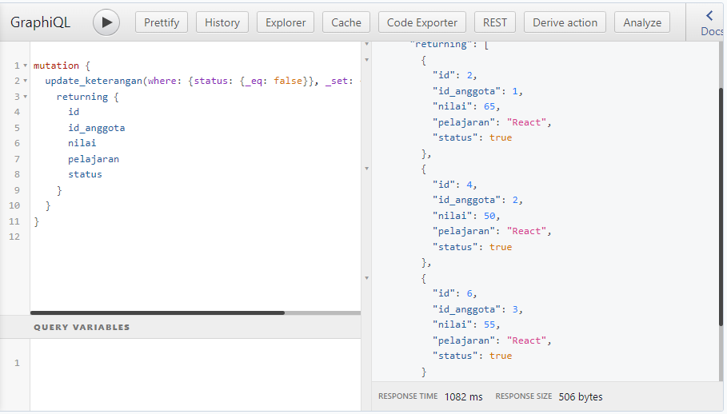

# 20 GraphQL Basic

## Resume

Pada materi ini saya mempelajari :

-   GraphQL
-   Setup GraphQL
-   Query, Mutation, Subscription

### GraphQL

GraphQL adalah sebuah query language yang dapat digunakan untuk membuat API. GraphQL membuat transfer data antara server dan client lebih mudah dan efektif.  
Dengan GraphQL, kita hanya memerlukan 1 endpoint untuk semua request, yaitu `/graphQL`.

Sebelum kita menggunakan graphQL, kita harus setup graphQL terlebih dahulu. Kita bisa menggunakan Hasura, Apollo server atau service sejenisnya. Kemudian kita dapat menggunakan GraphQL menggunakan client seperti Prisma, Apollo Client, Postman, dll.

Terdapat 3 fitur utama di dalam GraphQL client, yaitu:

-   Query, untuk mendapatkan data berdasarkan query yang diberikan.
-   Mutation, untuk melakukan insert, update, ataupun delete data.
-   Subscription, untuk mendapatkan data secara realtime atau berdasarkan event.

### Service untuk deploy GraphQL

#### Hasura & Heroku

Hasura merupakan sebuah platform service yang menyediakan GraphQL dan Rest API.  
Heroku merupakan sebuah platform cloud sebagai service yang menyediakan hosting untuk sebuah aplikasi. Heroku juga menyediakan postgres database gratis.

#### Apollo

Apollo Client merupakan sebuah state management library yang memungkinkan kita untuk mengelola data lokal dan remote dengan graphQL.  
Kita bisa menggunakan Apollo Client untuk fetch, cache, dan memodifikasi data.

Untuk menggunakan Apollo Client, kita dapat mengikuti cara berikut:

-   Install Apollo Client dengan command `npm i graphql @apollo/client`.
-   Buat `apollo-client.js` di dalam folder `src`.
-   Buat client baru dan export.

```js
import { ApolloClient, InMemoryCache } from '@apollo/client';

const client = new ApolloClient({
	uri: 'https://graphql-url.hasura.app/v1/graphql',
	cache: new InMemoryCache(),
	headers: {
		'x-hasura-admin-secret': 'SECRET_KEY',
	},
});

export default client;
```

| Option   | Fungsi                                                                     |
| -------- | -------------------------------------------------------------------------- |
| `uri`    | Diisi dengan url endpoint GraphQL.                                         |
| `cache`  | Gunakan InMemoryCache untuk menyimpan cache hasil query setelah fetch.     |
| `header` | Diisi untuk menidentifikasi user ketika request HTTP dikirimkan ke server. |

-   Setting Apollo provider di index.js

```jsx
import React from 'react';
import ReactDOM from 'react-dom';
import App from './app';
import { ApolloProvider } from '@apollo/client';
import client from './apollo-client';

ReactDOM.render(
	<ApolloProvider client={client}>
		<React.StrictMode>
			<App />
		</React.StrictMode>
	</ApolloProvider>,
	document.getElementById('root'),
);
```

### Query, Mutation, Subscription

#### Query

Dengan GraphQL kita dapat mengambil data yang kita inginkan hanya dengan menggunakan query.

##### Cara menggunakan Query

-   Import `gql` dan `useQuery`, kemudian masukan query yang ingin kita ambil.

```jsx
import { gql, useQuery } from '@apollo/client';

const GetTodoList = gql`
	query queryGetTodoList {
		todoList {
			complete
			id
			title
		}
	}
`;
```

-   Untuk mengambil intial data, gunakan `useQuery`.

```jsx
const { data, loading, error } = useQuery(GetTodoList);
```

`data`: Object yang berisi data yang diterima dari server.  
`loading`: Boolean yang menunjukkan apakah data sedang ditampilkan atau tidak.  
`error`: Object yang berisi error yang terjadi.

-   Untuk menggunakan data yang telah diterima, kita bisa map `data` dengan simbol `?` untuk mengecek apakah `data` kosong atau tidak.

```jsx
{
	data?.todolist.map((todo) => (
		<Todo
			key={todo.id}
			id={todo.id}
			onClickItem={() => onClickItem(todo.id)}
			onDeleteItem={() => onDeleteItem(todo.id)}
			title={todo.title}
			complete={todo.complete}
		/>
	));
}
```

-   Untuk menggunakan lazy query atau query yang dijalankan ketika user mengklik button, kita bisa menggunakan hook `useLazyQuery`.

```jsx
import { gql, useLazyQuery } from '@apollo/client';

function TodoList() {
	const [getTodoList, { data, loading, error }] = useLazyQuery(GetTodoList);

	const onClickGetData = () => {
		getTodoList();
	};
}
```

-   Untuk mengambil ulang data dari query yang sama, kita bisa gunakan `refetch`.

```jsx
import { gql, useLazyQuery } from '@apollo/client';

function TodoList() {
	const [getTodoList, { data, loading, error, refetch }] = useLazyQuery(GetTodoList);

	const onClickRefetchData = () => {
		refetch();
	};
}
```

#### Mutation

Mutation merupakan sebuah method untuk melakukan insert, update, ataupun delete data.

##### Cara menggunakan Mutation

-   import `gql` dan `useMutation` hooks dari apollo client.

```jsx
import { gql, useMutation } from '@apollo/client';

const InsertTodo = gql`
	mutation insertTodo($title: String!) {
		insert_todo(objects: { title: $title }) {
			returning {
				id
				title
			}
		}
	}
`;
```

-   Untuk insert data, gunakan hook `useMutation`.

```jsx
const [insertTodo, { loading, error }] = useMutation(InsertTodo, {
	refetchQueries: [{ query: GetTodoList }],
});
```

`refetchQueries`: Array yang berisi query yang akan di-refetch ketika mutation berhasil.

Setelah menggunakan hook `useMutation`, kita bisa menggunakan `insertTodo` untuk mengirimkan data ke server.

```jsx
insertTodo({ variables: { object: { title: 'Todo 1', user_id: 1 } } });
```

-   Untuk mengupdate data, gunakan hook `useMutation`.

```jsx
const [updateTodo, { loading, error }] = useMutation(UpdateTodo, {
	refetchQueries: [{ query: GetTodoList }],
});
```

Kemudian kita panggil `updateTodo` dengan parameter `object` yang berisi data yang akan diupdate.

```jsx
const onClickItem = (idx) => {
	const item = data?.todoList.find((item) => item.id === idx);
	updateTodo({ variables: { object: { id: idx, completed: !item.completed } } });
};
```

-   Untuk menghapus data, gunakan hook `useMutation`.

```jsx
const [deleteTodo, { loading, error }] = useMutation(DeleteTodo, {
	refetchQueries: [{ query: GetTodoList }],
});
```

Kemudian kita panggil `deleteTodo` dengan parameter `object` yang berisi data yang akan dihapus.

```jsx
const onDeleteItem = (idx) => {
	deleteTodo({ variables: { id: idx } });
};
```

#### Subscription

Subscription merupakan sebuah method untuk mendapatkan data secara realtime atau berdasarkan event.

##### Cara menggunakan Subscription

-   Pertama install `subcriptions-transport-ws` untuk mengaktifkan websocket connection dengan command `npm i subscriptions-transport-ws`.
-   Import semua module yang dibutuhkan.

```jsx
import { ApolloClient, InMemoryCache } from '@apollo/client';

import { split, HttpLink } from '@apollo/client';
import { getMainDefinition } from '@apollo/client/utilities';
import { WebSocketLink } from '@apollo/client/link/ws';
```

-   Gunakan `HttpLink` untuk query dan mutation, tapi gunakan `WebSocketLink` untuk subscription.  
    Gunakan `header` untuk autentikasi, dan gunakan `uri` websocket dari hasura console (`WebSocketLink` menggunakan `wss://`).

```jsx
const httpLink = new HttpLink({
	uri: 'https://some-link.hasura.app/v1/graphql',
	headers: {
		'x-hasura-admin-secret': 'SECRET_KEY',
	},
});

const wsLink = new WebSocketLink({
	uri: 'wss://some-link.hasura.app/v1/graphql',
	options: {
		reconnect: true,
		connectionParams: {
			headers: {
				'x-hasura-admin-secret': 'SECRET_KEY',
			},
		},
	},
});
```

-   Tambahkan `split` dan gunakan untuk menggabungkan 2 link tersebut.

```jsx
const link = split(
	({ query }) => {
		const definition = getMainDefinition(query);
		return definition.kind === 'OperationDefinition' && definition.operation === 'subscription';
	},
	wsLink,
	httpLink,
);

const client = new ApolloClient({
	link,
	cache: new InMemoryCache(),
});

export default cache;
```

-   Untuk cara menggunakan subscription, sama seperti cara menggunakan query. Tetapi subscription menggunakan hook `useSubscription`.

---

## Task

Untuk task section ini, saya harus mengimplementasikan query, dan mutation.

Berikut hasil task yang saya buat:  
[Github Repository](https://www.github.com/mbaharip/Assignment-GraphQL-Basic)



