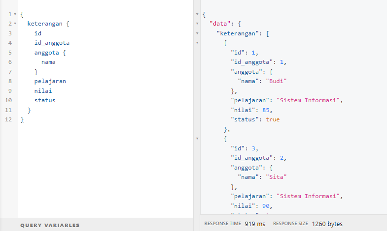
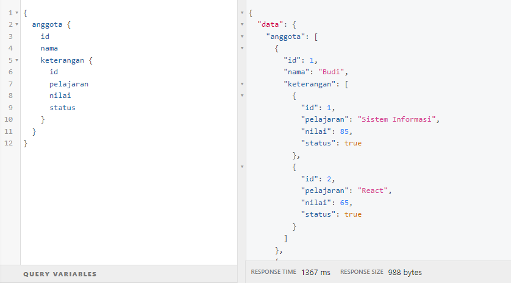

# 21 Relational Database

## Resume

Pada materi ini saya mempelajari :

-   Database
-   Database Relationship
-   Relational database implementation

### Database

Database adalah sebuah model yang menyimpan data secara terstruktur. Database dapat berupa tabel, ataupun relasi antar tabel. Database dapat berupa database relasional ataupun non-relasional.

### Database Relationship

Terdapat 3 model database relationship yaitu:

-   One to One, merupakan relasi antara satu tabel dengan satu tabel lainnya  
    contoh: 1 user hanya bisa memiliki 1 foto profil
-   One to Many, merupakan relasi antara satu tabel dengan beberapa tabel lainnya  
    contoh: 1 user bisa memiliki banyak postingan
-   Many to Many, merupakan relasi antara beberapa tabel dengan beberapa tabel lainnya  
    contoh: 1 user bisa memiliki banyak follower user lain, dan 1 user bisa juga difollow oleh banyak user lain

### Relational database implementation

Umumnya implementasi relational database menggunakan RDBMS (Relational Database Management System) seperti MySQL, PostgreSQL, Oracle, SQLite, Microsoft SQL Server, dan lain-lain.

Perintah dalam SQL terbagi menjadi 3 yaitu:

-   DDL (Data Definition Language)
-   DML (Data Manipulation Language)
-   DCL (Data Control Language)

Beberapa perintah DDL antara lain:

-   CREATE
-   USE
-   DROP
-   RENAME
-   ALTER

Beberapa perintah DML antara lain:

-   INSERT
-   SELECT
-   UPDATE
-   DELETE
-   LIKE / BETWEEN
-   AND / OR
-   ORDER BY
-   LIMIT

---

## Task

Untuk task pada section ini, saya diharuskan untuk membuat relasi untuk database yang saya buat di section sebelumnya.
Saya harus membuat relasi 1 to 1, dan 1 to many.

Berikut hasil task yang saya buat:  
[Github Repository](https://www.github.com/mbaharip/Assignment-Relational-Database)

### 1 to 1

### 1 to Many

