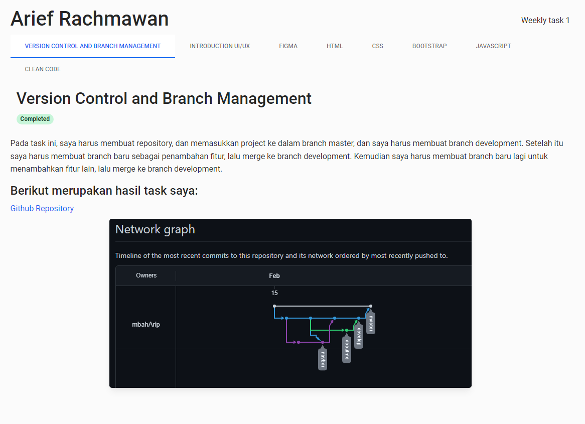

# 30 - Weekly 1

Task section ini sebagai berikut:

1. Mencari sebuah template bootstrap
2. Buat sebuah halaman yang berisikan rangkuman dari link maupun file yang telah dikerjakan
3. Boleh menggunakan list tree, basic tabs, atau bentuk lain sesuai dengan keinginan
4. Di dalam halaman harus berisikan, screenshots dari hasil tugas yang dapat dilihat langsung oleh user
5. Harus ada 8 task yang dibuat, dimulai dari Git sampai dengan Clean Code
6. Ada deskripsi untuk menjelaskan task tersebut

Berikut hasil task yang saya kerjakan:  
[Github Repository](https://github.com/mbahArip/Assignment-Weekly-1)  

