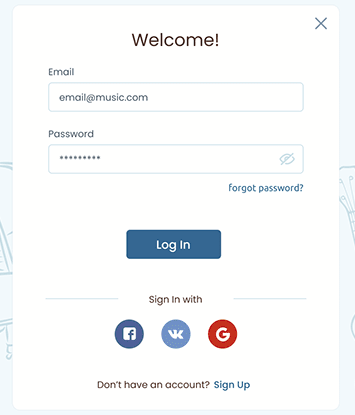
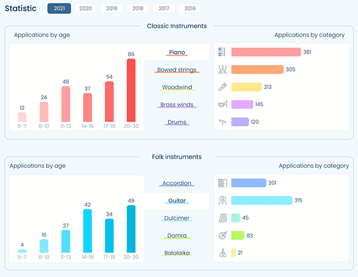
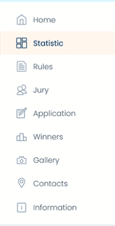
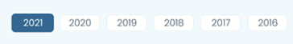
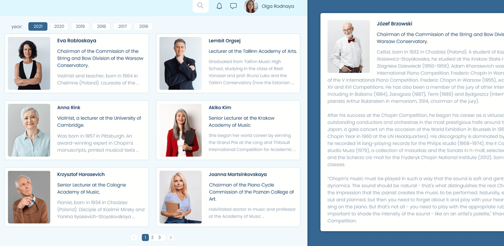
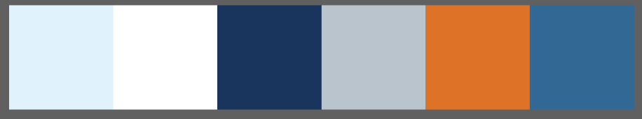

# 03 Introduction to UI/UX

## Resume

Pada materi ini saya mempelajari tentang:

-   User Experience
-   User Interface
-   User Persona

### User Experience

Merupakan apa yang user rasakan ketika menggunakan produk atau aplikasi kita. Terdiri dari 6 bagian, yaitu:

-   Business Logic
-   Technology
-   Interaction Logic
-   Design
-   Computer Communication
-   Business

Tahapan ketika mendesign sebuah UX sebagai berikut:  
**Empathize → Define → Ideate → Prototype → Validate**

-   Emphatize  
    Memahami apa yang user rasakan.
-   Define  
    Menentukan apa yang penting atau tidak penting untuk produk dan user.
-   Ideate  
    Membuat flow penggunaan aplikasi oleh user.
-   Prototype  
    Membuat simulasi atau sample yang menggambarkan final produk.

### User Interface

Merupakan visual yang user gunakan ketika berinteraksi dengan produk kita.  
UI didasari oleh 4 pilar utama, yaitu:

-   Consistency  
    User Interface menggunakan desain yang sama atau konsisten di setiap tampilan.
-   Keep the interface simple  
    Hilangkan elemen yang tidak diperlukan.
-   Good Typography  
    Memperhatikan typeface yang digunakan, dan juga memperhatikan perbedaan besar kecil, susunan, dan jenis font agar dapat terbaca dengan jelas.
-   Offer informative feedback  
    Feedback yang diberikan produk harus jelas

### User Persona

Merupakan profile dari user yang akan memakai produk kita. User persona biasanya berisikan ekspetasi, kebutuhan, tujuan, dan kebiasaan dari user.  
Pertanyaan yang mendasari user persona adalah **"Apa dan untuk siapa kita membuat desain ini?"**  
Dari data yang didapat di user persona ini, kita dapat membuat User Job Stories, dengan 3 inti yaitu Situation, Motivation, Outcome. Kemudian kita juga dapat membuat Usability Testing untuk mengetahui apakah user dapat menggunakan produk kita.

---

## Task

### 1. Cari dan identifikasi bagian-bagian desain UI/UX website

Identifikasi bagian-bagian desain dapat dilihat di [Google Docs](https://docs.google.com/document/d/1kzVPFC1tEI0nfzzvtObfej9fc7ytvgYJY0DbBksejMY/edit?usp=sharing)

### 2. Tentukan detail fitur dan letak dari UX

Untuk task 2 dan 3, saya memilih desain UI/UX Music Lights.

1. Login Page  
   User dapat login dengan menggunakan akun yang telah terdaftar, atau bisa juga dengan menggunakan akun sosial media.  
   
2. User Area  
   User area yang terdapat pada kanan atas memudahkan user untuk melihat informasi tentang akunnya, dan juga notifikasi, pesan ataupun mencari sesuatu yang terdapat di website ini.  
   
3. Filtering Data  
   Pada page lain, terdapat fitur untuk menyaring data yang ingin ditampilkan, fitur ini memudahkan user untuk melihat data berdasarkan tahun, ataupun instrumen.  
   

### 3. Tentukan detail fitur dan letak dari UI

1. Navigasi  
   Navigasi disamping kiri yang cukup jelas, memudahkan user untuk melihat halaman yang dituju.  
   
2. Konsistensi  
   Konsistensi dari elemen-elemen yang terdapat di website bisa dilihat dari contoh button yang dipakai.  
     
     
   
3. Keep the interface simple  
   Contoh pada page jury, user hanya dapat melihat sebagian deskripsi, agar fokus user bisa tertuju pada foto, nama, dan posisi jury tersebut.
   Sedangkan ketika kita klik pada card jury tersebut, maka munculah detail lengkap dari jury tersebut.
   

### 4. Tentukan color pallet dari desain tersebut

Color palet yang bisa saya ambil dari desain ini adalah sebagai berikut:

