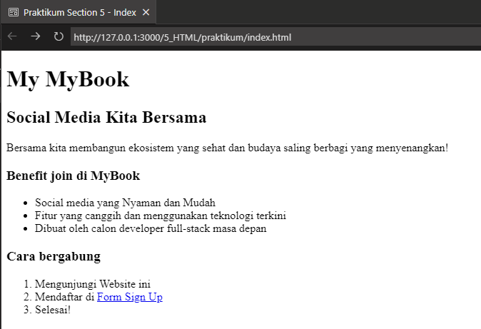

# 04 Figma

## Resume

Pada materi ini saya mempelajari:

-   Web development
-   HTML
-   Tags yang terdapat di dalam HTML

### Web development

Web development dibagi menjadi 2, yaitu:

-   Backend, bagian yang tidak berinteraksi langsung dengan user.
-   Frontend, bagian yang berinteraksi langsung dengan user.

Front end adalah bagian dari website yang membuat tampilan menarik kepada user, terdiri dari 3 komponen utama, yaitu:

-   HTML, berfungsi sebagai struktur yang akan membangun komponen website.
-   CSS, berfungsi membuat tampilan website lebih menarik.
-   Javascript, berfungsi untuk membuat website menjadi lebih dinamis.

### HTML

HTML atau Hypertext Markup Language dapat diartikan sebagai bahasa yang menggunakan marka untuk membuat sebuah website.
Beberapa kegunaan HTML adalah:

-   Membuat struktur konten.
-   Mengatur tampilan dan isi dari website.
-   Mempublikasikan halaman website secara online.

Beberapa tools code editor yang dapat dipakai antara lain:

-   Notepad
-   Visual Studio Code
-   Sublime Text
-   Notepad++
-   Atom

### Tags yang terdapat di dalam HTML

#### Tags penting

Tags penting yang harus ada di dalam HTML antara lain:

-   <! DOCTYPE html>, mendefinisikan dokumen ini sebagai HTML5.
-   \<html>, elemen root dari halaman html.
-   \<head>, elemen yang berisi informasi seperti judul, deskripsi, dan tag meta.
-   \<title>, elemen yang berisi judul dari halaman.
-   \<body>, elemen yang berisi konten dari halaman.

#### Tags konten

Tags konten di dalam HTML antara lain:

-   \
, tag yang biasanya digunakan untuk mengelompokkan elemen lainnya, bisa juga digunakan untuk menampilkan text.
-   \<h1> - \<h6>, tag yang digunakan untuk membuat judul.
-   \
, tag yang digunakan untuk membuat paragraf.
-   \<strong>, tag yang digunakan untuk membuat teks bold.
-   \<em>, tag yang digunakan untuk membuat teks italic.
-   \<s>, tag yang digunakan untuk membuat teks strike.
-   \<u>, tag yang digunakan untuk membuat teks underline.
-   \ , tag yang digunakan untuk membuat garis baru.
-   \, tag yang digunakan untuk membuat gambar. Attribute src diisi dengan link gambar, dan alt diisi dengan deskripsi gambar.
-   \<a>, tag yang digunakan untuk membuat link dengan memasukkan url yang akan dituju ke attribut href. Untuk membuka link di tab baru, tambahkan target="\_blank" pada tag a.

#### Tags Listing

Tag listing di html ada 2 jenis, yaitu:

-   Ordered List (\<ol>), digunakan untuk membuat daftar yang terurut.
-   Unordered List (\<ul>), digunakan untuk membuat daftar yang tidak terurut.

Setiap item dalam daftar harus ditambahkan dengan tag \<li> untuk menandai item tersebut.

#### Tags Table

Untuk membuat table di html, digunakan tag \<table> dan \<tr> untuk membuat baris dan \<td> untuk membuat kolom, dan \<th> untuk membuat kolom dengan judul.

#### Tags Form

Untuk membuat form di html, digunakan tag \<form>, kemudian di dalam tag form kita bisa mengisinya dengan input / label / button.

- \<input>, tag yang digunakan untuk membuat input dari user. Attribute type diisi dengan tipe input yang akan dibuat, contoh: text, password, email, dan lainnya.
- \<label>, tag yang digunakan untuk membuat label. Attribute for diisi dengan id input yang akan dibuat label.
- \<button>, tag yang digunakan untuk membuat button. Attribute type diisi dengan tipe button yang akan dibuat, contoh: submit, reset, dan lainnya.

---

## Task

### Buat 3 halaman web sederhana

Untuk tugas section ini, telah saya upload ke [Repository Github](https://github.com/mbahArip/Assignment-HTML) dan juga [Github Pages](https://mbaharip.github.io/Assignment-HTML/).  

