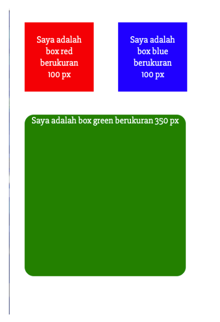
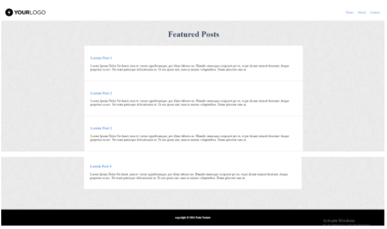
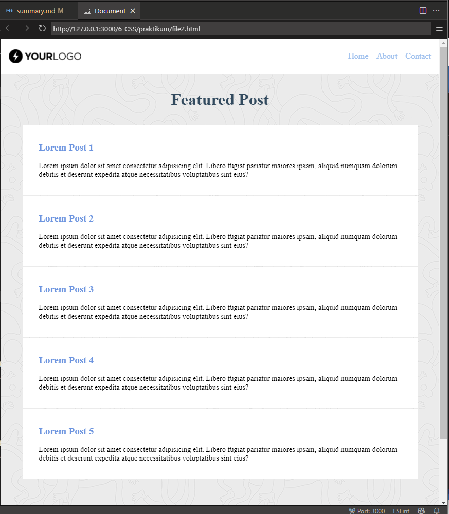

# 06 CSS

## Resume

Pada materi ini saya mempelajari:

-   CSS
-   CSS Selector
-   Beberapa contoh property CSS

### CSS

CSS merupakan singkatan dari Cascading Style Sheet, yang digunakan untuk mengatur tampilan dari sebuah website.
Ada 3 cara menambahkan CSS pada HTML, yaitu:

-   External, memasukkan tag \<link rel="stylesheet"> pada tag head.
-   Internal, menggunakan tag \<style> di dalam HTML.
-   Inline, menggunakan attribute style di elemen tunggal.

### CSS Selector

Selector di CSS merupakan kode yang digunakan untuk mengidentifikasi elemen yang akan ditampilkan.
Beberapa contoh selector yang dapat digunakan adalah:

-   \#id, untuk mengidentifikasi elemen dengan id tertentu.
-   \.class, untuk mengidentifikasi elemen dengan class tertentu.
-   \[attribute], untuk mengidentifikasi elemen dengan attribute tertentu.

Selector CSS juga dapat digunakan untuk memilih beberapa elemen sekaligus dengan cara menggunakan tanda koma. (Contoh: \#id1, \#id2, \#id3 akan memilih elemen dengan ID id1, id2, dan id3)

### Contoh property CSS

Berikut beberapa contoh property CSS dikelompokkan berdasar fungsi

#### Font

Property ini dapat digunakan untuk mengatur tampilan font pada elemen.

-   font-family, mengatur nama font.
-   font-size, mengatur ukuran font.
-   font-style, mengatur gaya font.
-   font-weight, mengatur tebal font.
-   font, mengatur semua property font diatas dalam 1 line.

\@font-face dapat digunakan untuk menambah font kedalam CSS. \@font-face memiliki beberapa property, yaitu:

-   font-family, nama font yang akan ditambahkan.
-   font-weight, tebal font yang akan ditambahkan.
-   font-style, gaya font yang akan ditambahkan.
-   src, url dari font yang akan ditambahkan.

Contoh:

```css
@font-face {
	font-family: 'Lato';
	font-style: normal;
	font-weight: 400;
	src: local('Lato Regular'), local('Lato-Regular'),
		url(https://fonts.gstatic.com/s/lato/v11/qIIYRU-oROkIk8vfvxw6QvesZW2xOQ-xsNqO47m55DA.woff) format('woff');
}
```

#### Margin dan Padding

Property ini dapat digunakan untuk mengatur margin dan padding atau ruang disekitar elemen.

Margin digunakan untuk mengatur jarak elemen ke elemen lain. Sedangkan padding digunakan untuk mengatur ruang disekitar elemen.

#### Background

Property ini dapat digunakan untuk mengatur background pada elemen.

-   background-color, mengatur warna background.
-   background-image, mengatur gambar background.
-   background-repeat, mengatur pengulangan gambar background.
-   background-position, mengatur posisi gambar background.
-   background-size, mengatur ukuran gambar background.
-   background, mengatur semua property background diatas dalam 1 line.

#### Display

Property ini dapat digunakan untuk mengatur tampilan elemen.

-   block, menampilkan elemen pada baris baru, dimulai dari kiri ke kanan.
-   inline, menampilkan elemen pada baris yang sama, dimulai dari kiri ke kanan.
-   none, menyembunyikan elemen.

#### Table

Property ini dapat digunakan untuk mengatur tampilan elemen tabel.

-   border-collapse, mengatur border pada elemen tabel.
-   table-layout, mengatur tampilan elemen tabel.
-   border-spacing, mengatur jarak antar border pada elemen tabel.

#### CSS Pseudo

CSS memiliki beberapa pseudo class yang digunakan untuk mengatur tampilan elemen. Beberapa contohnya sebagai berikut:

-   :hover, mengatur elemen saat mouse di hover.
-   :active, mengatur elemen saat mouse di klik.
-   :focus, mengatur elemen saat elemen tersebut mendapat focus.
-   :visited, mengatur elemen saat elemen tersebut telah dikunjungi.

Selain itu, CSS juga memiliki beberapa pseudo element yang digunakan untuk mengatur tampilan elemen. Beberapa contohnya sebagai berikut:

-   ::before, mengatur elemen sebelumnya.
-   ::after, mengatur elemen setelahnya.
-   ::first-line, mengatur elemen pertama dari baris.
-   ::first-letter, mengatur elemen pertama dari huruf.

---

## Task

### Ubah file1.html menjadi seperti contoh

#### File task 1 dapat diakses [disini](praktikum/file1.html).

Untuk tugas praktikum pertama, saya harus mengubah file HTML yang telah diberikan menjadi seperti yang terdapat di contoh.

Berikut adalah contoh dari soal:



Berikut hasil yang saya buat:


### Buat file2.html menjadi seperti contoh

#### File task 2 dapat diakses [disini](praktikum/file2.html).

Untuk tugas praktikum kedua, saya harus membuat file HTML dengan ketentuan yang telah ditentukan.

Berikut adalah contoh dari soal:



Berikut hasil yang saya buat:


