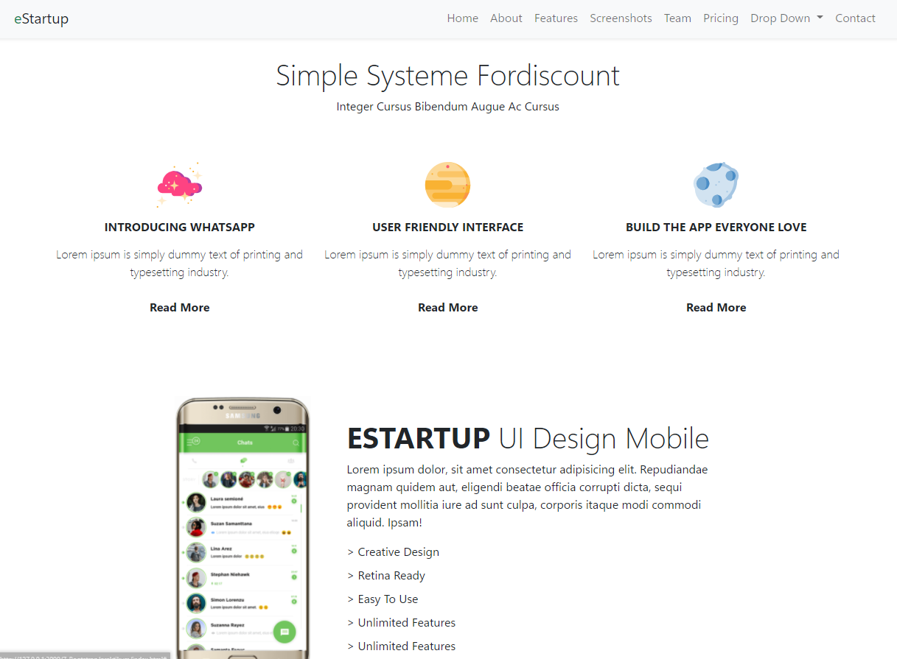

# 07 Bootstrap

## Resume

Pada materi ini saya mempelajari :

-   Apa itu bootstrap
-   Cara menggunakan bootstrap
-   Class pada bootstrap

### Apa itu bootstrap

Bootstrap merupakan Front End Framework, atau sekumpulan aturan kode yang bisa kita gunakan untuk mempermudah dalam membuat tampilan web.

Kenapa bootstrap?

-   Gratis
-   Mudah dipelajari
-   Cepat
-   Mendukung responsif

### Cara menggunakan bootstrap

Untuk menggunakan bootstrap ada 2 cara, yaitu dengan mendownload file bootstrap, atau dengan menggunakan CDN.

Jika menggunakan cara download, maka kita harus mendownload latest version dari bootstrap dari webnya, yaitu https://getbootstrap.com/ kemudian kita masukkan kedalam html.  
Jika menggunakan cara CDN, maka kita tinggal memasukkan link CDN yang telah disediakan ke dalam html.

Untuk penggunaannya, kita bisa membuat komponen kita sendiri dengan memasukkan nama-nama class pada elemen yang kita inginkan, atau jika lebih ingin cepat dan mudah kita dapat menggunakan komponen yang telah disediakan oleh bootstrap.

### Class pada bootstrap

Bootstrap menyediakan banyak class yang mudah dimengerti dan bisa digunakan untuk membangun sebuah website, berikut beberapa contoh:

-   d-block, akan memberikan style display block.
-   d-flex, akan memberikan style display flex.
-   row, akan membuat 1 row grid system dimana didalamnya akan terdapat elemen dengan class col.
-   col-md-6, akan membuat 1 kolom dengan lebar 6 grid system.
-   fw-bold, akan memberikan style font weight bold.
-   text-center, akan memberikan style text center.

---

## Task

### Membuat halaman web menggunakan bootstrap.

Untuk task ini saya diharuskan untuk membuat halaman web seperti yang terdapat di document task.  
Hasil file untuk task ini dapat diakses di [Repository Github](https://www.github.com/mbaharip/Assignment-Bootstrap).

Berikut merupakan hasil yang telah saya buat:  

